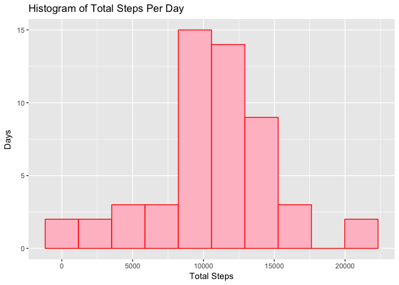
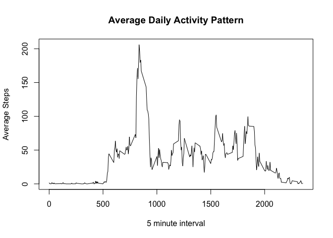
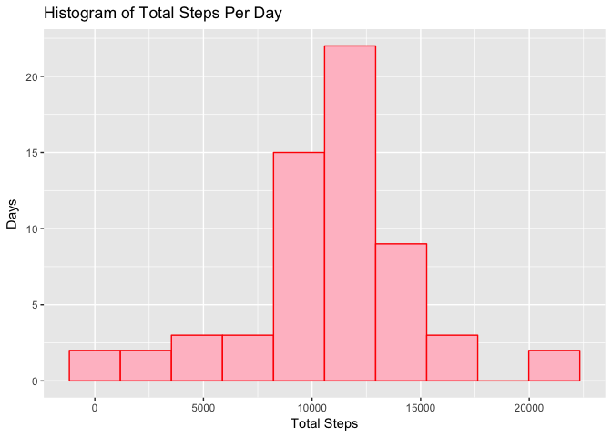
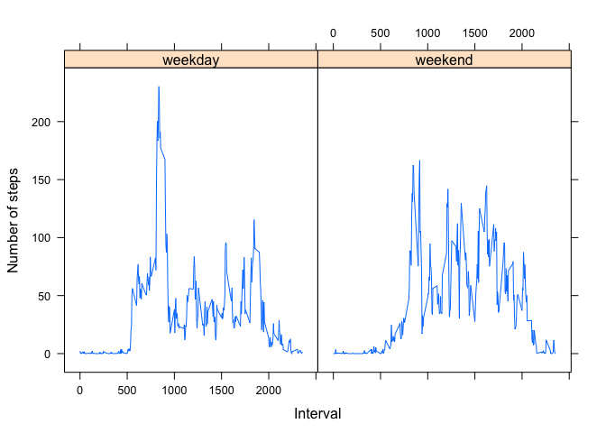

# Reproducible Research: Peer Assessment 1


```r
# Setting figure path as per requiremnt
library(dplyr)
library(ggplot2)
library(lattice)
```

## Loading and preprocessing the data

```r
unzip("activity.zip")
data <- read.csv("activity.csv")
```
Cast the date factor to date, this will help in plots.

```r
data$date <- as.Date(data$date, "%Y-%m-%d")
```


## What is mean total number of steps taken per day?
Aggregate the steps per day

```r
steps_per_day <- data %>% 
  group_by(date) %>% 
  summarise(total_steps = sum(steps))

steps_mean <- mean(steps_per_day$total_steps, na.rm = TRUE)
steps_median <- median(steps_per_day$total_steps, na.rm = TRUE)

qplot(steps_per_day$total_steps, main = "Histogram of Total Steps Per Day", xlab = "Total Steps", ylab = "Days", bins = 10, fill=I("pink"), col=I("red"))
```

```
## Warning: Removed 8 rows containing non-finite values (stat_bin).
```

<!-- -->

Mean of total steps per day **10766**.

Median of total steps per day **10765**.


## What is the average daily activity pattern?


```r
average_steps_in_interval <- data %>%
  group_by(interval) %>%
  summarise(avg_steps = mean(steps, na.rm = TRUE))

interval_with_max_avg_steps <- subset(average_steps_in_interval, avg_steps == max(average_steps_in_interval$avg_steps))$interval

plot(average_steps_in_interval$interval, average_steps_in_interval$avg_steps, type="l", xlab="5 minute interval", ylab="Average Steps", main="Average Daily Activity Pattern")
```

<!-- -->

The 5-minute interval with maximum number of steps averaged per day is **835**.

## Imputing missing values

```r
missing_rows <- dim(data)[[1]] - sum(complete.cases(data))
```
- The total number of rows with `NA`s = **2304**.
- Using the floor of average of the interval of all days for the missing interval values.

```r
complete_data <- data %>%
  left_join(average_steps_in_interval, by='interval') %>%
  mutate(steps = if_else(is.na(steps), as.integer(avg_steps), steps))
```

- Aggregate the steps per day

```r
complete_steps_per_day <- complete_data %>% 
  group_by(date) %>% 
  summarise(total_steps = sum(steps))

complete_steps_mean <- mean(complete_steps_per_day$total_steps)
complete_steps_median <- median(complete_steps_per_day$total_steps)

qplot(complete_steps_per_day$total_steps, main = "Histogram of Total Steps Per Day", xlab = "Total Steps", ylab = "Days", bins = 10, fill=I("pink"), col=I("red"))
```

<!-- -->

- Mean of total steps per day **10749**.
- Median of total steps per day **10641**.
- The values differ from the estimates from the first part, the center is more dense, the number of days with median number of steps increased.

## Are there differences in activity patterns between weekdays and weekends?

```r
data_with_day_type <- complete_data %>%
  mutate(day_type = as.factor(if_else(weekdays(date) %in% c("Sunday", "Saturday"), "weekend", "weekday")))

average_steps_in_interval_per_day_type <- data_with_day_type %>%
  group_by(interval, day_type) %>%
  summarise(avg_steps = mean(steps, na.rm = TRUE))

xyplot(avg_steps ~ interval | day_type, data=average_steps_in_interval_per_day_type, type="l", xlab="Interval", ylab="Number of steps")
```

<!-- -->
